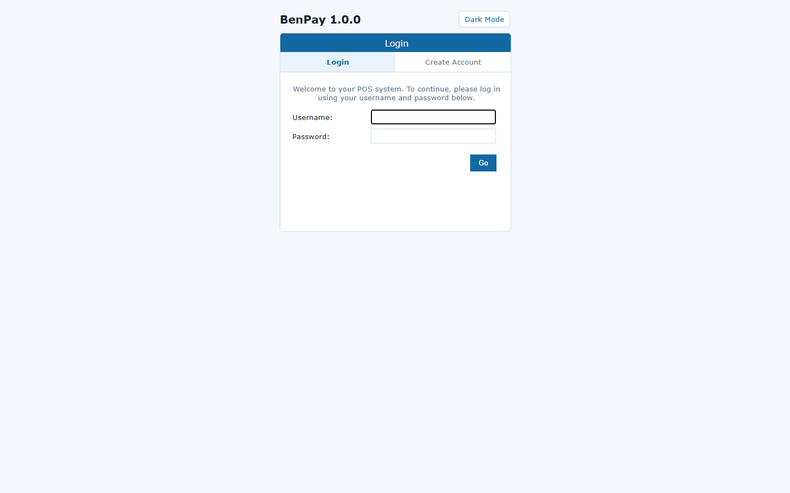
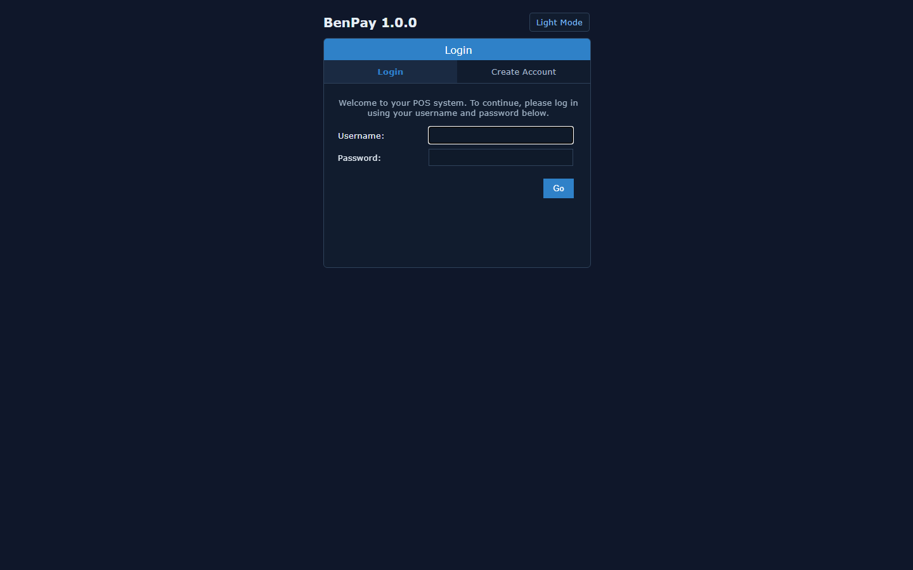
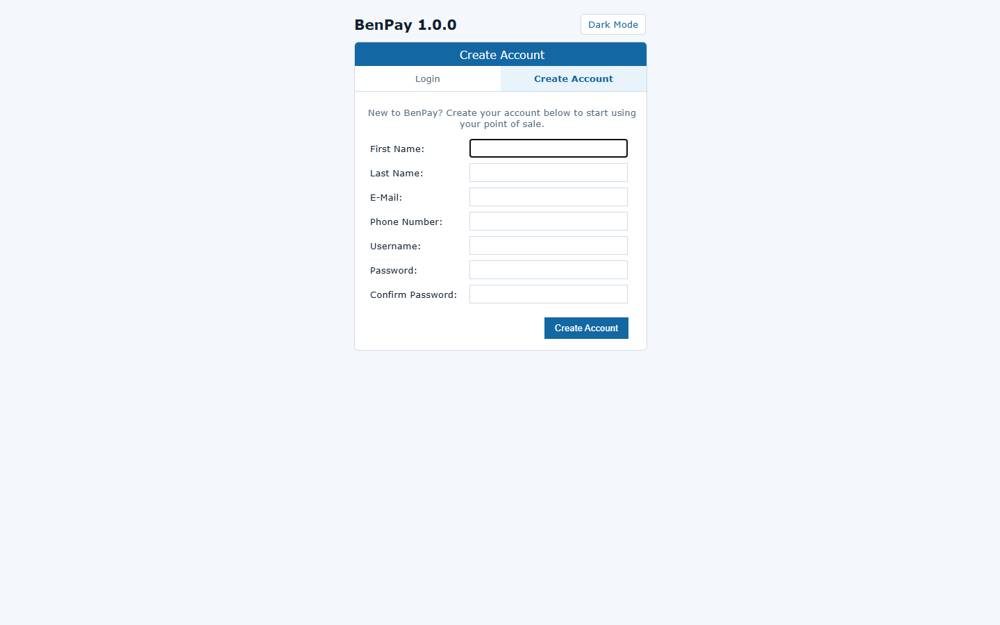
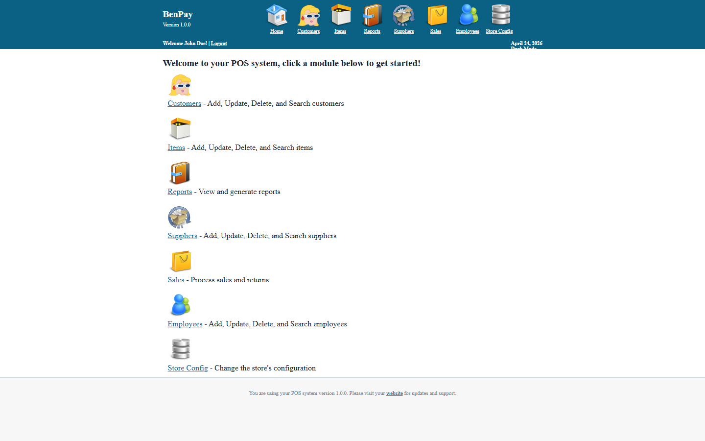
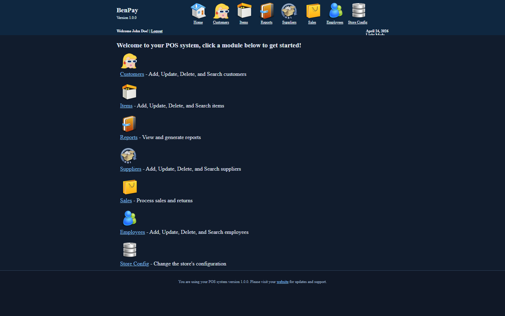

# BenPay POS

[](https://github.com/georgebenedict77/PHP-Point-Of-Sale/actions/workflows/ci.yml)

BenPay POS is a branded PHP/CodeIgniter point-of-sale system based on the PHP Point Of Sale codebase, updated with a cleaner onboarding experience and theme support for modern teams.

## Highlights

- BenPay branding defaults (`company` and `version` fallbacks)
- Light and dark mode toggle with local preference persistence
- New account creation flow directly from the login screen
- Legacy POS modules for sales, items, people, reports, and configuration
- CI pipeline for automated PHP syntax checks

## Screenshots

Login (Light)



Login (Dark)



Create Account



Dashboard (Light)



Dashboard (Dark)



## Quick Start

1. Create a MySQL/MariaDB database.
2. Import `database/database.sql`.
3. Copy `application/config/database.php.tmpl` to `application/config/database.php`.
4. Update database credentials in `application/config/database.php`.
5. Start the app with PHP (example):

```bash
php -S 127.0.0.1:8080 index.php
```

6. Open the app in your browser.

Default admin credentials:

- Username: `admin`
- Password: `pointofsale`

## Account Onboarding

New clients can use the **Create Account** tab on the login page to register an employee account. The account is created with cashier-level permissions and can be upgraded by an administrator.

## Theme Support

Users can switch between light and dark mode from the login page or app header. The selected theme is stored in browser local storage (`benpay_theme`) and persists across sessions.

## Quality Controls

GitHub Actions runs PHP linting on pushes and pull requests via `.github/workflows/ci.yml`.

## License

This project is distributed under GPL v3. See:

- `LICENSE.md`
- `license/gpl-3.0_license.txt`
- `license/codeigniter_license.txt`

## Changelog

See `CHANGELOG.md`.
